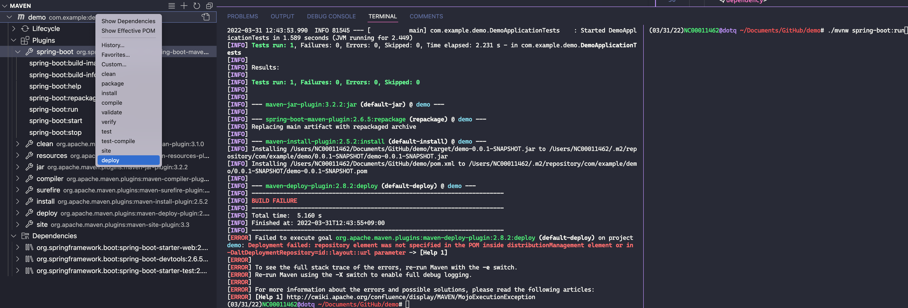

# spring-boot-vscode-is-site-up 🐳

## create new Spring boot project in VSCode
1. ＞spring initializer: maven
2. spring boot ver: 2.3.10
3. language: java
4. group id: `com.example`
5. artifact id: `demo`
6. packaging type: jar
7. java ver: 8
8. dependencies: `spring boot devtools` & `spring web`

## maven dependencies
JAVA PROJECTS > Maven Dependencies[+] > type `apache commons core` > choose `commons-jci-core`
=> auto add `pom.xml: <artifactId>commons-jci-core</artifactId>`

## run
1. ### by vscode
    - click `spring-boot:run` in VSCode
    > NOT right click project name (`demo`) > [deploy]: will ERR!!!
    ---
    
1. ### by CMD
    - `demo$ ./mvnw spring-boot:run`
    > if ERR after change code: right click > [clean] + [test-compile]
- access browser: `localhost:8080` => will see "Whitelabel Error Page"
- `http://localhost:8080/check?arg_url=https://www.google.com` => Site is up!
- `http://localhost:8080/check?arg_url=https://www.gggg.com` => Site is down!
