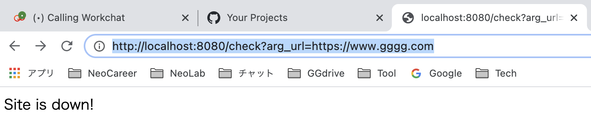

# spring-boot-is-site-up 🐳

## create new Spring boot project in VSCode

1. >spring initializer: maven
2. spring boot ver: 2.3.10
3. language: java
4. group id: `com.example`
5. artifact id: `demo`
6. packaging type: jar
7. java ver: 8
8. dependencies: `spring boot devtools` & `spring web`
>(note) `JAVA PROJECTS > Maven Dependencies[+] > apache commons core > commons-jci-core`
=> add `pom.xml: <artifactId>commons-jci-core</artifactId>`

## run
1. click `run` in VSCode
2. access browser: `localhost:8080`
3. `http://localhost:8080/check?arg_url=https://www.google.com` => Site is up!
4. `http://localhost:8080/check?arg_url=https://www.gggg.com` => Site is down!

